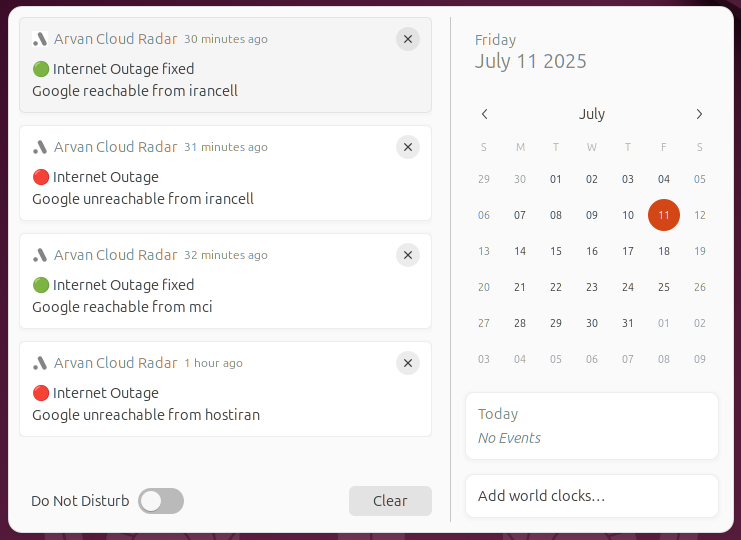

# Radar Notif

A desktop notification system that monitors internet connectivity across various Iranian ISPs using ArvanCloud's Radar service.


## Features

- Real-time monitoring of multiple ISPs
- Desktop notifications for internet outages and recoveries
- Cross-platform support (Linux, Windows, macOS)
- Concurrent monitoring of multiple ISPs
- Configurable service monitoring (currently set to Google)

## Prerequisites

- Go 1.16 or higher
- Make (for building)

## Installation

1. Clone the repository:
```bash
git clone https://github.com/yourusername/radar-notif.git
cd radar-notif
```

2. Build for your platform:

For all platforms:
```bash
make all
```

Or build for a specific platform:
```bash
make linux   # For Linux
make windows # For Windows
make mac     # For macOS
```

The built executables will be available in the `build` directory.

## Usage

Simply run the executable for your platform:

```bash
./build/radar-linux        # On Linux
./build/radar-mac          # On macOS
./build/radar-windows.exe  # On Windows
```

The application will:
- Start monitoring the configured ISPs every minute
- Show desktop notifications when internet connectivity issues are detected
- Display notifications when connectivity is restored
- Print real-time status updates in the terminal

## Monitored ISPs

- Sindad (Multiple locations)
- Bertina
- AbrBaran
- Tehran Network
- HostIran
- ParsOnline
- Afranet
- MCI
- Irancell

## Common Issues

1. Notification not working:
   - Make sure you have notification permissions enabled on your system
   - Verify that the `icon.png` file is in the same directory as the executable

2. Build errors:
   - Ensure you have Go 1.16 or higher installed
   - Run `go mod tidy` to resolve any dependency issues

3. Runtime errors:
   - Check your internet connection
   - Verify that ArvanCloud's Radar service is accessible

For more issues, please check the [Issues](https://github.com/yourusername/radar-notif/issues) page.

## Contributing

Contributions are welcome! Please feel free to submit a Pull Request.

## License

This project is open source and available under the MIT License.

## Acknowledgments

- Thanks to ArvanCloud for providing the Radar API
- Uses [beeep](https://github.com/gen2brain/beeep) for cross-platform notifications

---


